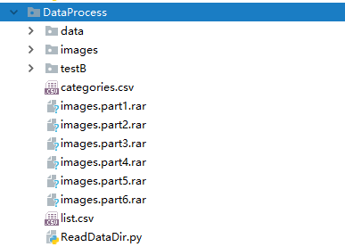
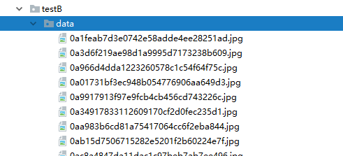

# FutureLab_ImageClassify所需第三方框架  
pytorch 0.4.0 
torchvison 0.2.1 
请访问
https://pytorch.org/
获取pytorch在不同系统下的安装方法
 
numpy: anaconda自带或使用命令 pip install numpy 
 
 
本机运行环境 Windows10 GPU: TITANXP 12G * 2 内存 32768MB 联网环境
 
 
如何使用 
1.创建训练集 
将list.csv，categories.csv文件放在DataProcess中，把数据放在imgages/data中，如下图所示 
 
在DataProcess中运行ReadDataDir.py 
生成data文件夹，里面就是生成的训练集 
2.训练    （可直接运行，使用默认参数） 
在classy/train_center_loss,py进行训练，  
我们使用了ImageNet, 请在联网的环境运行，或http://data.lip6.fr/cadene/pretrainedmodels/resnext101_64x4d-e77a0586.pth下载 
我们的训练参数保存在temp文件夹内 
log文件保存在logs文件夹内 
运行train_center_loss.py时可加参数--data 后选择训练图片路径 
运行train_center_loss.py时可加参数--batch_size 后选择训练的batch大小 
 
3.测试      (可直接运行，使用默认参数) 
在classy/test_center_loss.py进行测试， 
此时要求图片放在一个文件内即可。默认DataProcess/testB/data 
 
输出结果默认保存在result文件夹内 
运行test_center_loss.py时可加参数--data 后选择训练图片路径 
运行test_center_loss.py时可加参数--model-path 后选择保存的模型路径 
运行test_center_loss.py时可加参数'--result-path 后选输出csv文件的路径 
